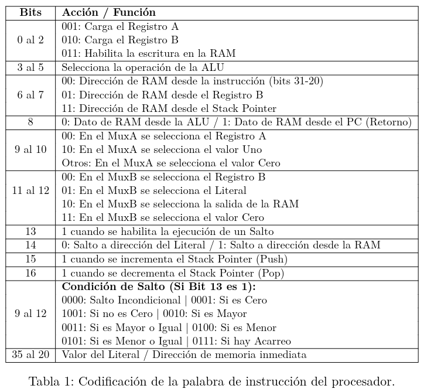
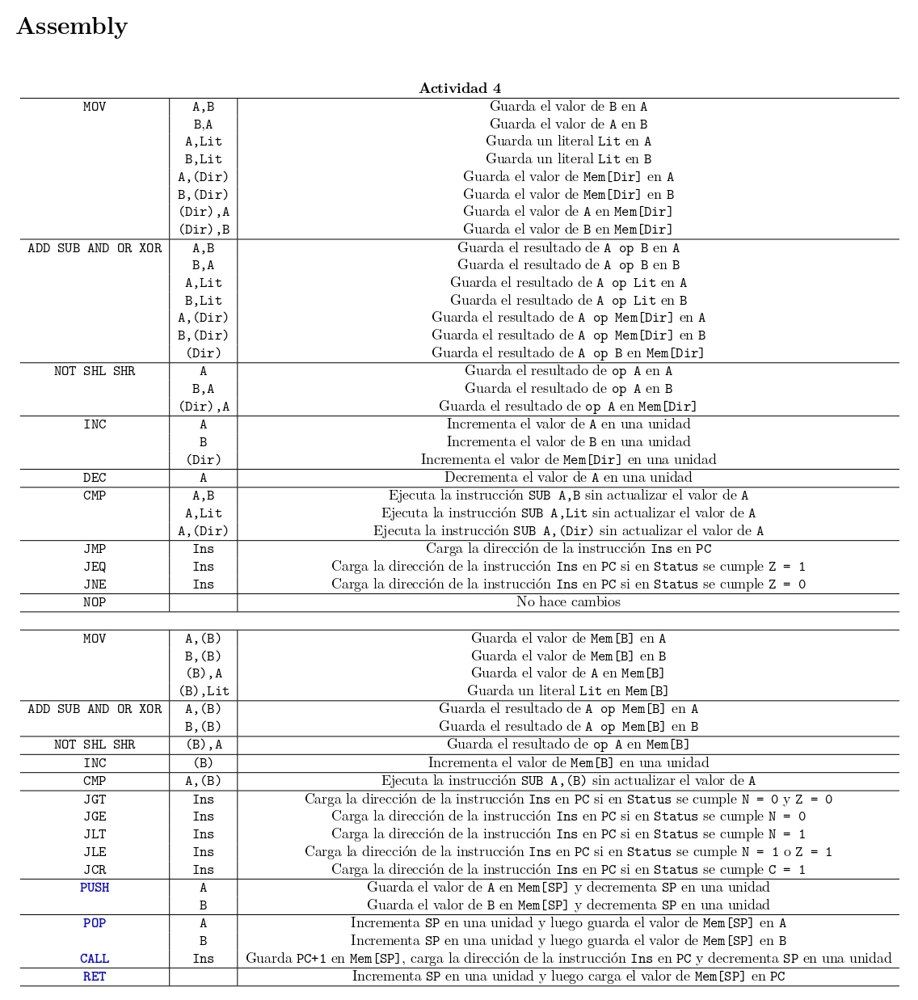
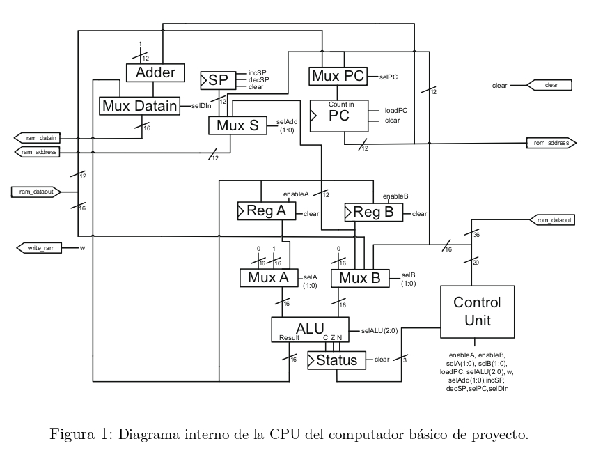

# Myssembler (Desactualizado)

### **¿Que es Myssembler?**

Myssembler es un ensamblador customizado para un computador basico revisado en el ramo Arquitectura de Computadores IIC2343 de la Pontificia universidad de Chile. Este fue programado con VDHL en la plataforma de Vivado y cargado en una Basys 3 con arquitectura Artix 7.

Este proyecto tiene un fin meramente investigativo, de practica y estudio de la materia.

### **¿Que hace Myssembler?**

Se encarga de traducir a OPCODES compatibles con la arquitectura del computador basico codigo basico assembly de dos tipos:

* Estructura de codigo propietario para un computador basico
* RISC 5

Para esto se presenta un selector

* a OPCODE y un método secreto Craftssembly.

### **Estructura de Myssembly**

My

## Escritura de Codigo

## Traduccion a Opcodes

### Codigo Propietario:



###



### Diagrama de Hardware (Assembly)



Programador computador basico:


```vhdl
library IEEE;
use IEEE.STD_LOGIC_1164.ALL;

entity  Programmer is
    Port ( rx : in std_logic;
           tx : out std_logic;
           clk : in std_logic;
           clock : in std_logic;
           bussy   : out std_logic;
           ready   : out std_logic;
           address : out std_logic_vector (11 downto 0);
           dataout : out std_logic_vector (35 downto 0));
end Programmer;

architecture Behavioral of Programmer is

component UART 
    Port (  clk      : in  std_logic;
            rx       : in  std_logic;
            tx       : out  std_logic;
            reset    : in  std_logic;
            tx_enable: in  std_logic;
            rx_enable: out  std_logic;
            tx_ready : out  std_logic;
            rx_data  : out  std_logic_vector (7 downto 0);
            tx_data  : in std_logic_vector (7 downto 0)
            );
    end component;

signal tx_ready      : std_logic;
signal tx_enable     : std_logic;
signal rx_enable     : std_logic;
signal rx_data       : std_logic_vector (7 downto 0);
signal tx_data      : std_logic_vector (7 downto 0);

type memory_array is array (0 to 5) of std_logic_vector (7 downto 0);
signal memory : memory_array;

signal state : std_logic_vector(4 downto 0);
signal ready_sinc : std_logic;
signal bussy_sinc : std_logic;

 
begin

tx_data <= "00000000";
tx_enable <= '0';

bussy_prosses: process (clock, bussy_sinc)
        begin
          if bussy_sinc = '1' then
            bussy <= '1';
          elsif (rising_edge(clock)) then
            if (bussy_sinc = '0') then
              bussy <= '0';
            end if;
          end if;
        end process;


ready_prosses: process (clk)
        begin
          if (rising_edge(clk)) then
            if (ready_sinc = '1') then
              ready <= '1';
            else
              ready <= '0';
            end if;
          end if;
        end process;


data_prosses: process (rx_enable)
        begin
          if (rising_edge(rx_enable)) then
            if ( state = "00000" and rx_data = "11111111" ) then
                bussy_sinc <= '0';
                ready_sinc <= '0';
            elsif( state = "00000" and rx_data = "10101010") then 
                state <= "00001";
                ready_sinc <= '0';
            elsif( state = "00001" and rx_data = "10101010") then
                bussy_sinc <= '1';
                state <= "10001"; 
            elsif( state = "00001") then
                state <= "00000"; 
            elsif ( state = "10001" ) then
                memory(0) <= rx_data;
                state <= "10010";
            elsif ( state = "10010") then
                memory(1) <= rx_data;
                state <= "10011";
            elsif ( state = "10011" ) then
                memory(2) <= rx_data;
                state <= "10100";
            elsif ( state = "10100" ) then
                memory(3) <= rx_data;
                state <= "10101";  
            elsif ( state = "10101" ) then
                memory(4) <= rx_data;
                state <= "10110";   
            elsif ( state = "10110" ) then
                memory(5) <= rx_data;
                state <= "10111";          
            elsif ( state = "10111" and rx_data = "10101010" ) then
                state <= "00000";
                ready_sinc <= '1';
                address <= memory(0) & memory(1)(7 downto 4);
                dataout <= memory(1)(3 downto 0) & memory(2) & memory(3) & memory(4) & memory(5);   
            elsif ( state = "10111") then
                state <= "00000";
            end if;
          end if;
        end process;

inst_UART: UART port map(
        clk       => clk,
        rx        => rx,
        tx        => tx,
        reset     => '0',
        tx_enable => tx_enable,
        rx_enable => rx_enable,
        tx_ready  => tx_ready,
        rx_data   => rx_data,
        tx_data   => tx_data
    );   

end Behavioral;

```


```vdhl

```
